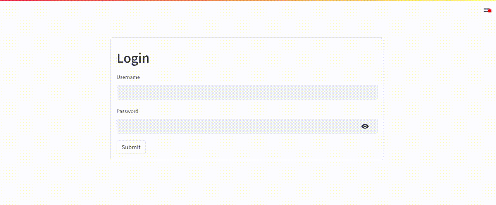

# chatgpt-streamlit

Yet another chatgpt web made by streamlit!

Online Demo on [Huggingface](https://huggingface.co/spaces/Willder/chatgpt-streamlit)

## Feature
 
- Multi chats
- OpenAI parameter adjustment
- Different Role(Prompt) Selection
- Chat name editable
- Delete chats
- Export conversion to markdown
- Support downloading all tables in answer to excel
- Support streaming
- Authenticate
- Regenerate
- Stop generating while streaming

## Start

1. Python3 environment ready.
2. First fill your openai key in  `.streamlit/secrets.toml`
3. Install requirement. `python3 -m pip install -r requirements.txt`
4. Launch. `streamlit run 🏠_Home.py`

 